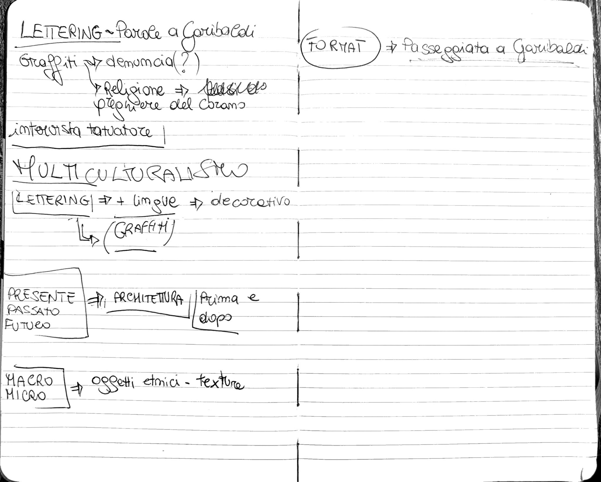

 
#### Gruppo che approfondisce il tema del ***Multiculturalismo*** su Piazza Garibaldi

Questa documentazione ha l’obiettivo di registrare e descrivere in dettaglio il processo di realizzazione del progetto, dalla concezione iniziale fino al prodotto finale. 
Verranno dettagliati gli strumenti utilizzati, le persone e le risorse coinvolte, così da avere una visione completa e comprensibile del lavoro svolto.

###### 13.01.2025  

Dopo la presentazione delle tesi abbiamo deciso di approfondire i temi dei vari gruppi che si sono formati in laboratorio.
Le macroaree che analizzeremo sono 3:

1. Graffiti-Lettering; 
2. Micro-macro con oggetti di diverse culture (come cibo, tessuti, ecc); 
3. La storia della Piazza  (passato presente e futuro) con la ricerca di video di repertorio e attuali.

L’idea alla base potrebbe essere quella di riprendere una passeggiata, e quindi tutto il flusso della piazza, e poi analizzare nello specifico alcuni particolari.  

###### 21.01.2025

### Le **prime riprese**
Il gruppo ha deciso di registrare alcuni momenti della passeggiata.
L'area in cui ci siamo mossi è la galleria della metropolitana e il percorso che porta all'arena.

Volevamo che la ripresa fosse dal basso, quindi abbiamo filmato tenendo il telefono all'altezza delle ginocchia. Tuttavia, ci siamo accorti che le riprese risultavano troppo mosse e instabili, e quindi non riuscivano a trasmettere l'idea in modo chiaro.

