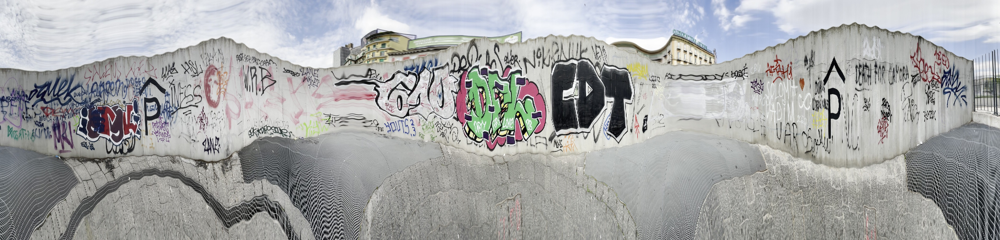

20 Febbraio 2025

<h1 class="title">Trama del territorio</h1>

Con l'organizzazione dei nuovi tavoli di lavoro, il gruppo che inizialmente si concentrava sulla sperimentazione con le texture  (utilizzando tecniche come il __frottage__, __micro/macro__ e __scan__) ha subito una trasformazione, orientandosi verso un focus più specifico: utilizzare questi strumenti per evidenziare le _trame del territorio_, e realizzre un layer per la mappa di Piazza Garibaldi. 

10 Marzo 2025

<h1 class="title">Incontro ad Ingegneria</h1>
Oggi siamo stati ad Ignegneria per incontare Andrea, Michele e Giovanni (il _Presidente_ per gli amici). 

 

21 Marzo 2025

<h1 class="title">Frottage su altre superfici</h1>

Oggi in Piazza Garibaldi abbiamo fatto delle prove su altre superfici, come il pavimento gommato, le corde della giostra vicino la _Portineria_, le reti del campo di Basket, e le mattonelle del pavimento.

<!DOCTYPE html>
<html lang="it">
<head>
  <meta charset="UTF-8">
  <title>Video di prova</title>
</head>
<body>

  <h1>Guarda il video qui sotto!</h1>

  <video width="600" controls>
    <source src="video/videofrtottage.mp4" type="video/mp4">
    Il tuo browser non supporta il tag video.
  </video>

</body>
</html>

[Guarda il video](video/videofrtottage.mp4)

24 Marzo 2025

<h1 class="title">Dalle <strong>lenzuola</strong> alla <strong>carta</strong></h1>

Il censimento vegetale della piazza è stato __*temporaneamente sospeso*__. 
Ci siamo chiesti se fossero davvero necessarie superfici così ampie (come le lenzuola) per raccogliere dati, e soprattutto se fosse sufficiente imprimere solo trama solo gli alberi.
Da qui è nata una nuova direzione: sospendere il frottage sulle lenzuola e iniziare a sperimentare direttamente con la carta.

Questo perché crediamo ancora nel frottage come strumento per conoscere il territorio e pretesto per tessere relazioni con chi questo territorio lo attraversa quotidianamente (ma non sta ancora succedendo).

Quindi ecco la lista dei nostri nuovi materiali: 

| Oggetto      | Cratateristiche |
| ----------- | ----------- |
| Foglio di carta      | per adesso ha le dimensioni di un A5 e uno spessore di 135/200gr      |
| Pittura   | è un inchiostro a base di acqua, lavabile e ad asciugatura rapida |
| Argilla polimerica industraile (es. _Fimo_) | pasta modellabile, che non si asciuga all'aria; è ideale come stampo |

16 Aprile

Aggiornamneto sull’andamento del gruppo Frottage/Panoramica in piazza. 
Abbiamo migliorato il codice per la _panoramica inversa_: ora basta inserire un video in una cartella e il programma restituisce automaticamente la panoramica inversa finita. 
Detto ciò, abbiamo fatto alcune prove in piazza: ci siamo ripresi mentre camminavamo (seguendo traiettorie non lineari) e abbiamo inquadrato le facciate degli edifici!!

Per quanto riguarda il Frottage, abbiamo continuato a scendere in piazza per rivelare le superfici presenti, e in questo momento stiamo catalogando e caricando tutte le prove sul Drive. Alcuni di noi stanno anche lavorando alla nuova forma del timbro in 3D (che usiamo come supporto dove attaccare l'argilla light), per ottimizzare il processo e il funzionamento generale. Abbiamo inoltre pensato di organizzare una prova ufficiale del workshop di Frottage il 30/04, coinvolgendo circa 25 persone inesperte per simulare come potrebbe svolgersi l’attività in piazza.
