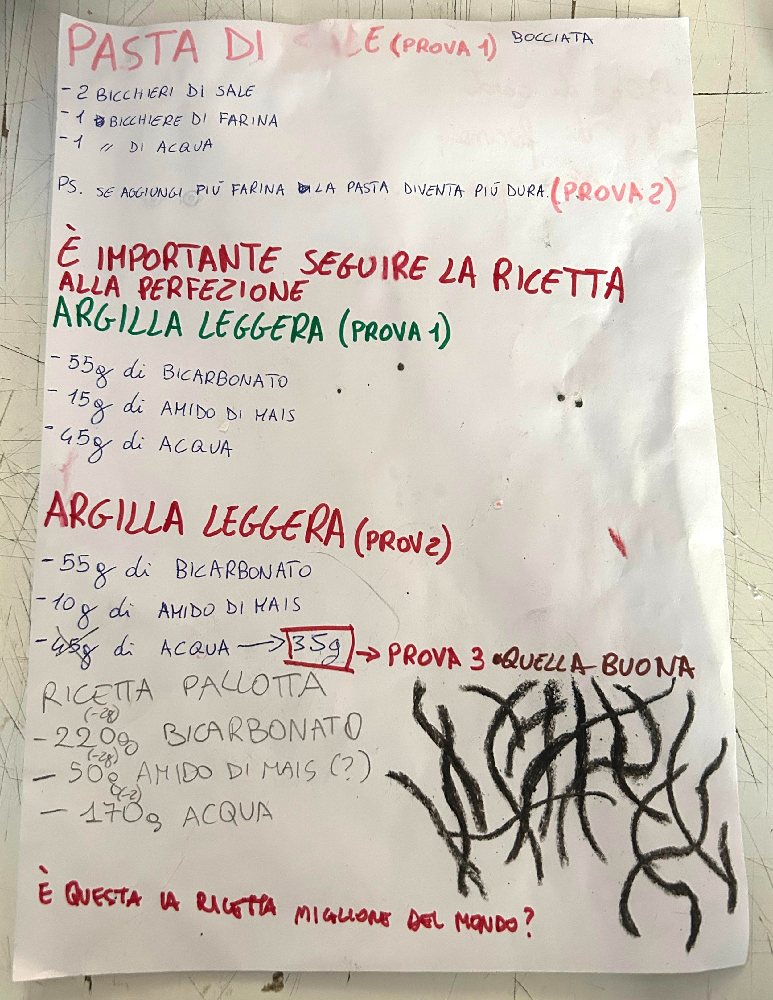

[Il video che ci ha ispirato](https://www.instagram.com/reel/DCU6_Y_o2Qw/?utm_source=ig_web_copy_link)

Per realizzare i primi stampi, abbiamo inizialmente utilizzato l’argilla polimerica, un materiale sintetico molto *versatile* che rimane morbido a temperatura ambiente e si indurisce solo se cotto ad alte temperature (solitamente intorno ai 110-130°C). Questo ci ha permesso di realizzare im "calchi" di forme complesse e dettagliate, senza il rischio che il materiale si asciugasse o indurisse durante il lavoro. 

Poiché abbiamo apprezzato molto la praticità di questo metodo, abbiamo deciso di cercare un’alternativa più sostenibile e adatta alla produzione autonoma in laboratorio. Dopo un confronto con il gruppo Bioplastica, ci siamo orientati verso l'argilla light: un impasto leggero, biodegradabile e facilmente modellabile, ottenuto con ingredienti naturali e a basso impatto ambientale. Anche perché su alcune superfici, come la corteccia dell'albero, l'argilla polimerica restava appiccicata e non veniva via con facilità.

