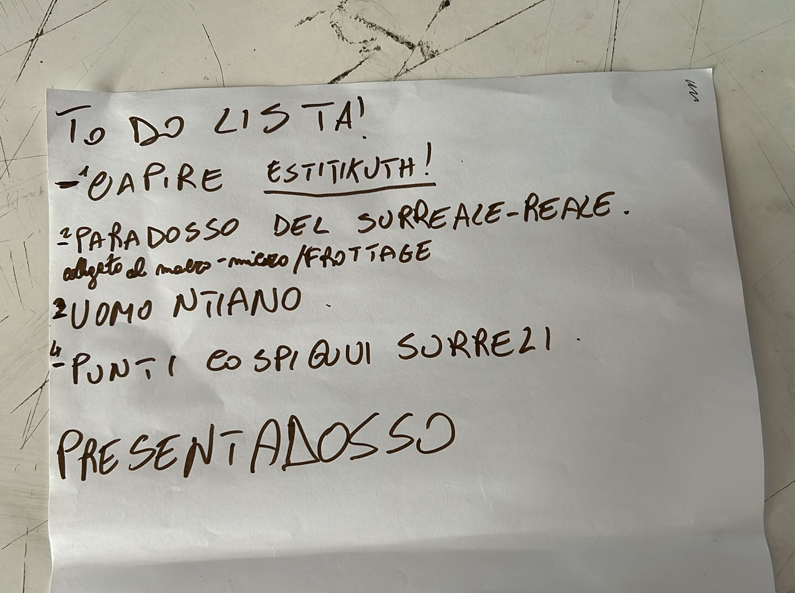
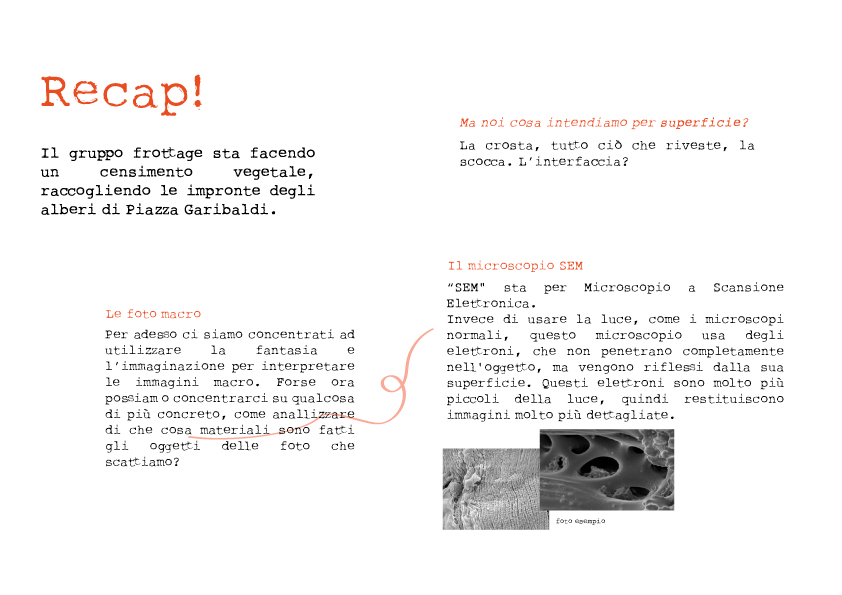
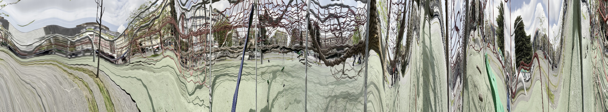
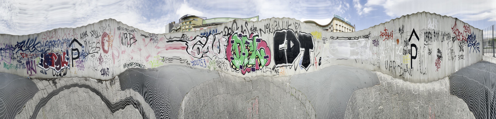
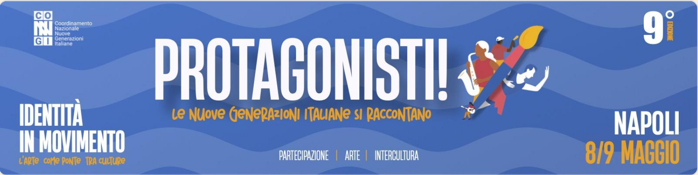
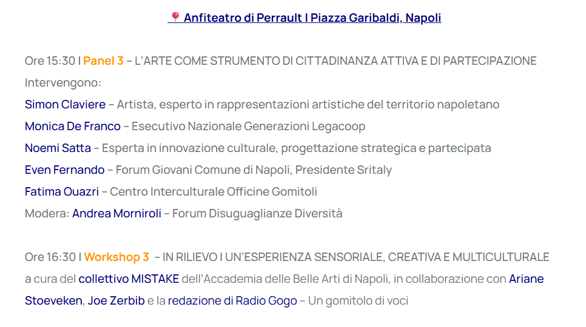

20 Febbraio 2025

<h1 class="title">Trama del territorio</h1>

Con l'organizzazione dei nuovi tavoli di lavoro, il gruppo che inizialmente si concentrava sulla sperimentazione con le texture  (utilizzando tecniche come il __frottage__, __micro/macro__ e __scan__) ha subito una trasformazione, orientandosi verso un focus più specifico: utilizzare questi strumenti per evidenziare le _trame del territorio_, e realizzre un layer per la mappa di Piazza Garibaldi. 

10 Marzo 2025

<h1 class="title">Incontro ad Ingegneria</h1>
Oggi siamo stati ad Ignegneria per incontare Andrea, Michele e Giovanni (il _Presidente_ per gli amici). 

 

21 Marzo 2025

<h1 class="title">Frottage su altre superfici</h1>

Oggi in Piazza Garibaldi abbiamo fatto delle prove su altre superfici, come il pavimento gommato, le corde della giostra vicino la _Portineria_, le reti del campo di Basket, e le mattonelle del pavimento.

<!DOCTYPE html>
<html lang="it">
<head>
  <meta charset="UTF-8">
  <title>Video di prova</title>
</head>
<body>

  <h1>Guarda il video qui sotto!</h1>

  <video width="600" controls>
    <source src="video/videofrtottage.mp4" type="video/mp4">
    Il tuo browser non supporta il tag video.
  </video>

</body>
</html>

[Guarda il video](video/videofrtottage.mp4)

24 Marzo 2025

<h1 class="title">Dalle <strong>lenzuola</strong> alla <strong>carta</strong></h1>

Il censimento vegetale della piazza è stato __*temporaneamente sospeso*__. 
Ci siamo chiesti se fossero davvero necessarie superfici così ampie (come le lenzuola) per raccogliere dati, e soprattutto se fosse sufficiente imprimere solo trama solo gli alberi.
Da qui è nata una nuova direzione: sospendere il frottage sulle lenzuola e iniziare a sperimentare direttamente con la carta.

Questo perché crediamo ancora nel frottage come strumento per conoscere il territorio e pretesto per tessere relazioni con chi questo territorio lo attraversa quotidianamente (ma non sta ancora succedendo).

Quindi ecco la lista dei nostri nuovi materiali: 

| Oggetto      | Cratateristiche |
| ----------- | ----------- |
| Foglio di carta      | per adesso ha le dimensioni di un A5 e uno spessore di 135/200gr      |
| Pittura   | è un inchiostro a base di acqua, lavabile e ad asciugatura rapida |
| Argilla polimerica industraile (es. _Fimo_) | pasta modellabile, che non si asciuga all'aria; è ideale come stampo |

16 Aprile

Aggiornamneto sull’andamento del gruppo Frottage/Panoramica in piazza. 
Abbiamo migliorato il codice per la _panoramica inversa_: ora basta inserire un video in una cartella e il programma restituisce automaticamente la panoramica inversa finita. 
Detto ciò, abbiamo fatto alcune prove in piazza: ci siamo ripresi mentre camminavamo (seguendo traiettorie non lineari) e abbiamo inquadrato le facciate degli edifici!!

Per quanto riguarda il Frottage, abbiamo continuato a scendere in piazza per rivelare le superfici presenti, e in questo momento stiamo catalogando e caricando tutte le prove sul Drive. Alcuni di noi stanno anche lavorando alla nuova forma del timbro in 3D (che usiamo come supporto dove attaccare l'argilla light), per ottimizzare il processo e il funzionamento generale. Abbiamo inoltre pensato di organizzare una prova ufficiale del workshop di Frottage il 30/04, coinvolgendo circa 25 persone inesperte per simulare come potrebbe svolgersi l’attività in piazza.

30 Aprile 2025

<h1 class="title">Preparazione del Workshop di Maggio</strong></h1>

L'8 e il 9 Maggio 2025 si terrà a Napoli il seminario “Identità in Movimento”, organizzato dal CoNNGI.
L’iniziativa, in collaborazione con il Ministero del Lavoro e delle Politiche Sociali, metterà al centro il ruolo dell’arte come strumento di inclusione, partecipazione e costruzione identitaria per le nuove generazioni, con particolare attenzione ai giovani con background migratorio.

Noi parteciperemo come _Mistake_ giovedì 8 maggio al panel dedicato alla partecipazione. 

[Qui il programma dell'evento](https://www.coopdedalus.it/evento/protagonisti-le-nuove-generazioni-italiane-si-raccontano-ix-edizione/)

Ci stiamo organizzando insieme al gruppo documentario: loro faranno delle interviste insieme alla redazione di RadioGogo, mentre noi faremo frottage con l'argilla light.

Oggi abbiamo incontrato, nella sede di Officine Gomitoli all'ex Lanificio, Fatima, Joe e l'artista Ariane Stoeveken per organizzare le ultime cose.
Abbiamo capito che il nostro gruppo di partecipanti potrà prenotarsi al workshop tramite il form, e scegliere in anticipo quale delle due attività fare. 
Questo per noi è importante perché possiamo capire il numero di partecipanti da prendere in considerazione per capire quanto materiale preparare.
Dovrebbero essere circa 50 partecipanti (magari 25 con _Documentario_ e 25 con _Frottage_). 

7 Maggio 2025

<h1 class="title">Ma cosa succederà domani?</strong></h1>
L'idea prevede l’utilizzo di quattro lettere rosse in spugna, usate lo scorso anno a Procida. 
In una prima fase del workshop, durante la parte teorica, le lettere comporranno la parola “cittadinanza”, posizionata sulle scale dell’[Arena](https://maps.app.goo.gl/ks14WNqP3FkQLr4i7)
Una volta terminata la parte teorica, quattro lettere (le più stabili) verranno selezionate dalla scritta e riutilizzate come postazioni nei pressi della portineria, sotto l’ombra degli alberi. Qui i partecipanti troveranno tutto il materiale necessario per il frottage.

Le lettere sono già state trasferite all’ex Lanificio, nella sede di Dedalus, e saranno portate in piazza poco prima dell’inizio del workshop.

8 Maggio 2025

<h1 class="title">Workshop in piazza</strong></h1>

Oggi in laboratorio completiamo gli ultimi preparativi. In particolare, durante la mattinata, abbiamo preparato l'impasto di argilla light (circa 20 panetti, 4 per ogni shopper)
con la solita ricetta.  

Ma cosa contengono le shopper?

19 Aprile 2025

<h1 class="title">Turbogiornata per l'immersive reserch</strong></h1>

Ci siamo divisi in gruppi, ognuno con il proprio Layer (noi sempre quello di _Trama del territorio_)
La prima fase è stata di SWOT, che è una pratica di rielaborazione dati e pianificazione del lavoro per valutare i punti di forza (S), le debolezze (W), le opportunità (O) e le minacce (T).
Poi c'è stato tutto il lavoro sulle cartelle Drive: abbiamo controllato e caricato tutto il materiale fotografico raccolto durante l'anno, scritto il nostro concept, i materiali usati, le tecniche e le varie sperimentazioni. 

[Qui il drive](https://drive.google.com/drive/folders/16OfVmQJghyTqqmana7EKatjnMq1Z8fsN?fbclid=IwY2xjawKfIDVleHRuA2FlbQIxMABicmlkETBxTUJoSlJnOHdHc0Z3SXY1AR7Ng1w2HSpy_eLXU-5W-e47g6BDWOD0fl0pj8ad9fANkS1OKAx7NxqDeUfymA_aem_b88DKaEcEwaLgy5KLQvkxA)