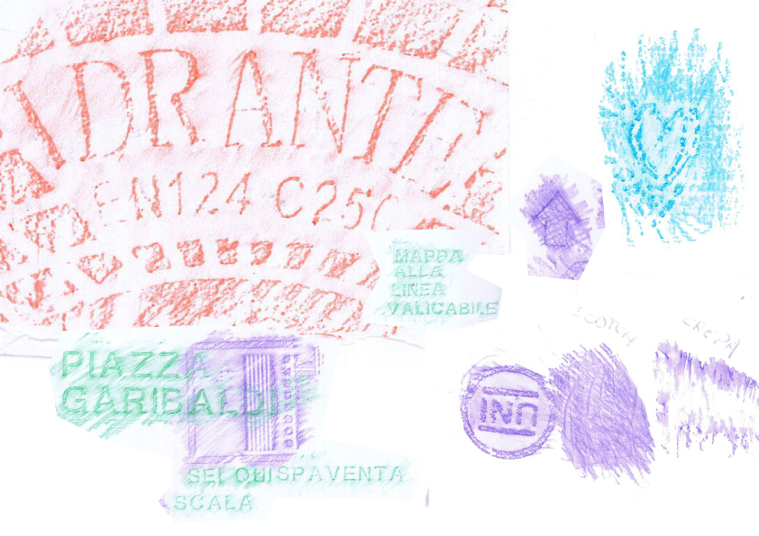

La tecnica del _frottage_ è una pratica artistica che consiste nel trasferire l’impronta di una superficie su un altro materiale, utilizzando il metodo dello “sfregamento". La tecnica è stata sviluppata dal pittore surrealista Max Ernst nel 1925, come parte della sua esplorazione del mondo dell'inconscio e dell'arte automatica.

In piazza abbiamo iniziato ad utilizzare fogli di carta e gesso, ma ci siamo resi conto che avevamo bisogno di un supporto più rigido e resistente. Così, abbiamo deciso di passare alla stoffa e alla pittura.

