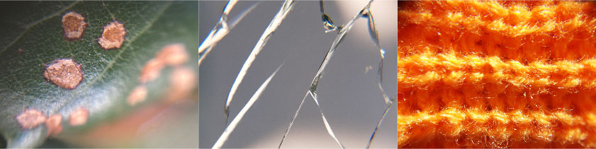
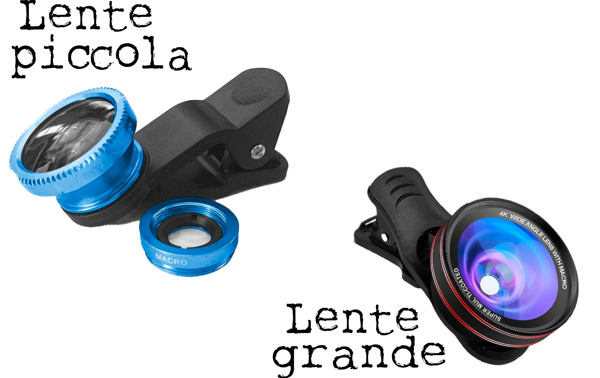

La **lente macro** è un tipo di lente fotografica che permette di scattare immagini di oggetti molto piccoli a una distanza ravvicinata, rivelando dettagli che non sono visibili ad occhio nudo, come le _venature di una foglia_ e la _texture di un tessuto_.
Quelel che abbiamo usato noi sono pensate per essere messe sulle fotocamere di un telefono.

La prima lente macro che abbiamo usato in piazza era piccolissima e si attaccava al telefono con una pinza. Abbiamo scattato molte belle foto interessanti, ma serviva molta attenzione, perché spesso le immagini venivano sfocate o avevano un bordo nero strano. Dopo un po', abbiamo provato una lente più grande e i risultati sono migliorati. Le foto sono più nitide, anche se, forse sono meno ravvicinate.

