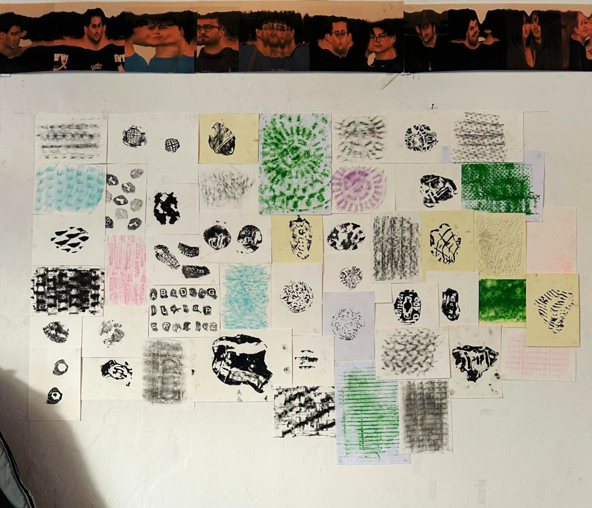

__Ma come facciamo a catalogare tutte le nostre prove?__
Sul retro di ogni cartoncino ci sono segnate le informazioni più importanti: la data, la tecnica utilizzata e le coordinate precise del luogo in cui è stato realizzato.
Li abbiamo appesi al muro, uno accanto all’altro, accostandoli per soggetto (perché molto spesso abbiamo provato diverse tecniche sullo stesso elemento).

Abbiamo anche un catalogo digitale delle porve:
[Guarda qui!](https://docs.google.com/document/d/12AIHLc0RvvurcrAS5_sDQkBSLV6eEvbAfCycROGGsew/edit?usp=sharing)
